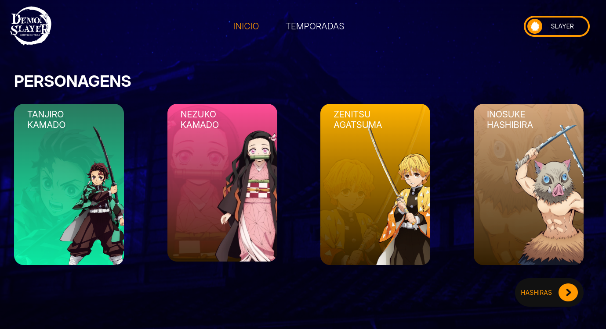

# 🎉 **Bem-vindo ao projeto: Demon Slayer (sem criatividade para nome :))** 🚀

Este projeto é uma atividade do curso FullStack no Vai na Web onde usamos um método de array `map()`.

## ℹ️ Sobre o Projeto

 O objetivo principal era criar alguns dados e renderizar usando o `map()`.

## 🔧 Ferramentas Utilizadas

O projeto foi construído utilizando as seguintes tecnologias:

- **React**: Biblioteca JavaScript para criação de interfaces de usuário.
- **Vite**: Ferramenta de build rápida para desenvolvimento de projetos front-end.
- **SCSS**: Extensão do CSS que adiciona recursos como variáveis e aninhamento.
- **react-router-dom**: Biblioteca para gerenciamento de rotas em aplicações React.
- **prop-types**: Biblioteca para validação de tipos de props em componentes React.

## 🚀 Executando o Projeto

Siga as instruções abaixo para configurar e executar o projeto em seu ambiente local:

### Passos para Executar

1. **Clone o repositório:**

   ```bash
   git clone https://github.com/Davi-D18/demon-slayer.git
   ```

2. **Navegue até o diretório do projeto:**

   ```bash
   cd demon-slayer
   ```

3. **Instale as dependências:**

   ```bash
   npm install
   ```

4. **Execute o projeto em modo de desenvolvimento:**

   ```bash
   npm run dev
   ```

5. **Abra no navegador:**

   O projeto estará disponível em:

   ```
   http://localhost:5173
   ```

## 🌐 Estrutura do Projeto

```plaintext
src/
├── components/               # Componentes reutilizáveis do projeto.
│   └── Header/               # Componente do cabeçalho.
│       ├── style/            # Estilos específicos do Header.
│       │   └── header.module.scss
│       └── Header.jsx
│
├── data/                     # Contém dados estáticos usados no projeto.
│   └── personagens.js
│
├── pages/                    # Páginas do projeto.
│   ├── EmBreve/              # Página "Em Breve".
│   │   ├── style/            # Estilos específicos da página.
│   │   │   └── emBreve.module.scss
│   │   └── EmBreve.jsx
│   │
│   ├── home/                 # Página inicial do projeto.
│   │   ├── style/            # Estilos específicos da Home.
│   │   │   └── home.module.scss
│   │   ├── Home.jsx
│   │
│   ├── personagemDetalhes/  # Página de detalhes dos personagens.
│   │       ├── style/        # Estilos específicos da página de detalhes.
│   │       │   └── personagemDetalhes.module.scss
│   │       └── PersonagemDetalhes.jsx
│
├── styles/                   # Arquivos de estilos globais.
│   ├── _variables.scss       # Variáveis globais para as páginas.
│   ├── global.scss           # Estilos globais da aplicação.
│
├── App.jsx                   # Componente raiz da aplicação.
├── main.jsx                  # Ponto de entrada da aplicação.

public/
├── fundos/                   # Imagens de fundo usadas no projeto.
│   ├── fundo-casa.png
│   └── fundo-hashiras.png
│
├── icons/                    # Ícones usados na aplicação.
│   ├── Ellipse.png
│   ├── EllipseVerde.png
│   └── seta-direita.png
│
├── logo/                     # Logo do projeto.
│   └── logo.png
│
├── personagens/              # Imagens dos personagens.
│   ├── inosuke/              # Imagens do personagem Inosuke.
│   │   ├── inosuke-detalhes.png
│   │   ├── inosuke-fundo.png
│   │   └── inosuke.png
│   │
│   ├── nezuko/               # Imagens da personagem Nezuko.
│   │   ├── nezuko-detalhes.png
│   │   ├── nezuko-fundo.png
│   │   └── nezuko.png
│   │
│   ├── tanjiro/              # Imagens do personagem Tanjiro.
│   │   ├── tanjiro-detalhes.png
│   │   ├── tanjiro-fundo.png
│   │   └── tanjiro.png
│   │
│   └── zenitsu/              # Imagens do personagem Zenitsu.
│       ├── zenitsu-detalhes.png
│       ├── zenitsu-fundo-pagina.png
│       └── zenitsu-fundo.png
```

## ✨ Screenshot



## Links

### Design
Esse Design foi feito de um layout do Figma na comunidade do Figma

* 👉🏻 [Figma](https://www.figma.com/community/file/1260047539346273329/demon-slayer-web-ui)

### Deploy

* [Vercel](https://demon-slayer-seven.vercel.app/)

## Estrutura Inicial
Esse projeto foi iniciado a partir de outra estrutura pronta, uma estrutura configurada para projetos React com SCSS modularizado e outras ferramentas. 

- 👉🏻 [link](https://github.com/Davi-D18/b_react-scss)
